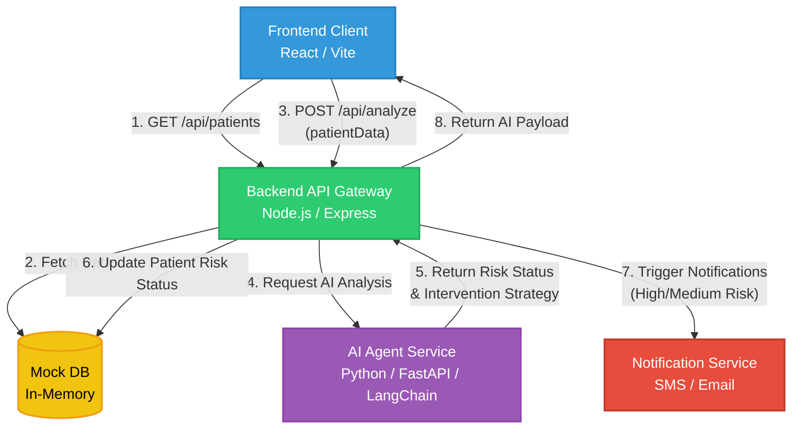

# Healthcare AI Adherence Flow

Below is the high-level architecture and data flow for the Healthcare AI Adherence platform. 
This flowchart details how the UI interacts with the Gateway Backend, which coordinates with the AI Agent and external Notification Services.

## System Components

1. **Frontend**: A React/Vite web application that displays patient status, adherence levels, and triggers AI analysis.
2. **Backend API Gateway**: The main orchestration layer built in Node.js. It manages local persistent mock data, delegates reasoning and NLP tasks to the AI agent, and invokes external tasks like notifications.
3. **AI Agent Service**: A FastAPI server running Python with Langchain. It receives the patient context, uses LLMs/RAG (ChromaDB) to determine risk profile and suggests evidence-based clinical interventions.
4. **Notification Service**: Mock service responsible for simulating outgoing SMS/Email alerts for medium/high-risk adherence alerts. 
